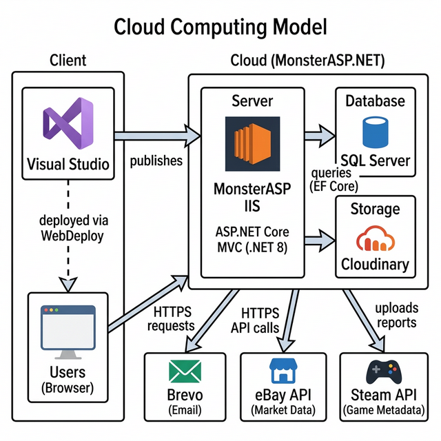

# Cloud Computing Model

Design the cloud system and define how all parts of the cloud lifecycle fit together.

## Figure 1: Cloud Computing Model

## Cloud Lifecycle Fit
| Lifecycle Phase | KSTech Implementation |
| --- | --- |
| Plan | Define release scope, schema impact, and rollback path. |
| Build | Implement features in ASP.NET MVC and EF Core migrations. |
| Validate | Run local build, smoke tests, and verify generated SQL script on test database. |
| Release | Publish via WebDeploy from Visual Studio and execute SQL script on MonsterASP database. |
| Operate | Monitor logs, login activity, email outbox, and integration health. |
| Optimize | Tune queries/indexes, tighten security permissions, and improve deployment automation. |

---

# Operational and Economical Feasibility

Provide at least one alternative for each service used and compare their performance, security, scalability, and cost.

## Figure 2: Frontend Stack
| Service | Performance | Security | Scalability | Cost |
| --- | --- | --- | --- | --- |
| Razor Views via ASP.NET Core MVC (`Current`) | High, fast server-rendered HTML output | No exposed API surface to attack | Scales together with the backend server | Low, included in the existing stack |
| React / Next.js (Alternative) | High, supports client-side SPA and SSR | Requires separate API layer for security | Independent frontend scaling via CDN | Medium, requires separate deployment setup |

## Figure 3: Client Deployment
| Service | Performance | Security | Scalability | Cost |
| --- | --- | --- | --- | --- |
| MonsterASP IIS (`Current`) | Good for small to medium workloads | Managed IIS with TLS encryption | Limited elastic scaling on shared plan | Low monthly hosting cost |
| Vercel (Alternative) | High with global edge CDN delivery | Built-in HTTPS and DDoS protection | Strong automatic global scaling | Medium, free tier available with limits |

## Figure 4: Server
| Service | Performance | Security | Scalability | Cost |
| --- | --- | --- | --- | --- |
| MonsterASP Shared IIS (`Current`) | Good, handles moderate traffic reliably | Managed IIS with TLS encryption | Limited by shared hosting plan tiers | Low monthly cost for shared hosting |
| Azure App Service (Alternative) | High with managed autoscale options | Strong identity and network access controls | Strong horizontal and vertical scaling | Medium to High depending on tier |

## Figure 5: Backend Stack
| Service | Performance | Security | Scalability | Cost |
| --- | --- | --- | --- | --- |
| ASP.NET Core MVC (.NET 8) (`Current`) | High, compiled runtime with EF Core | Strong built-in authentication and session middleware | Vertical scale on current shared hosting | Low, already implemented and running |
| Laravel (Alternative) | Good, mature PHP framework with ORM | Mature security ecosystem with built-in protections | Good horizontal scale with platform setup | Medium to High due to full rewrite cost |

## Figure 6: Object Storage
| Service | Performance | Security | Scalability | Cost |
| --- | --- | --- | --- | --- |
| Cloudinary (`Current`) | Good throughput for report uploads | API key authentication over HTTPS | Scales with plan, sufficient for reports | Low, free tier covers current usage |
| Azure Blob Storage (Alternative) | High, optimized for large-scale storage | Managed identity with built-in encryption | Strong elastic scale for any volume | Low to Medium depending on storage used |

## Figure 7: Database Platform
| Service | Performance | Security | Scalability | Cost |
| --- | --- | --- | --- | --- |
| MonsterASP SQL Server (`Current`) | Good for moderate transactional workloads | SQL authentication with TLS encryption | Limited by hosting plan tiers | Low to Medium monthly cost |
| Azure SQL Database (Alternative) | High with managed performance tuning | Advanced threat detection and audit features | Strong elastic scale with auto-tuning | Medium to High depending on tier |

## Figure 8: Email Delivery Service
| Service | Performance | Security | Scalability | Cost |
| --- | --- | --- | --- | --- |
| Brevo (`Current`) | Good API throughput for transactional emails | API key secured with HTTPS transport | Scales for transactional and campaign workloads | Low, free tier covers current volume |
| SendGrid (Alternative) | High throughput with mature deliverability tools | API key with domain authentication support | High enterprise scale for large volumes | Medium, pricing based on email volume |

---

# Architecture Decision Summary
- Current architecture is cost-effective and practical for deployment on MonsterASP.
- KSTech uses a monolithic architecture where the frontend (Razor Views) and backend (ASP.NET Core MVC) are deployed together on the same server.
- Main tradeoff is scalability and advanced security control compared with full cloud PaaS offerings.
- Recommended future path: keep current deployment for stable operation, then migrate to managed cloud services (App Service + Azure SQL) when traffic, compliance, or uptime requirements increase.
